# TDA Morphotypes

Topological data analysis of human body shapes: persistent homology of 3D body
scans for anomaly detection, gender discrimination and morphotype
classification.

This repository contains the code of the paper

> **Human Body Shapes Anomaly Detection and Classification Using Persistent Homology**
> Steve de Rose, Philippe Meyer, Frédéric Bertrand.
> *Algorithms* **16**(3), 161, 2023. <https://doi.org/10.3390/a16030161> (open access)

Running it regenerates every table and data figure of the paper from the raw
scans. Of the 144 published values that are checked automatically, 143 are
recovered exactly. The last one is a proportion misprinted in the paper (see
[Reproducibility](#reproducibility)).

<table>
  <tr>
    <td width="30%">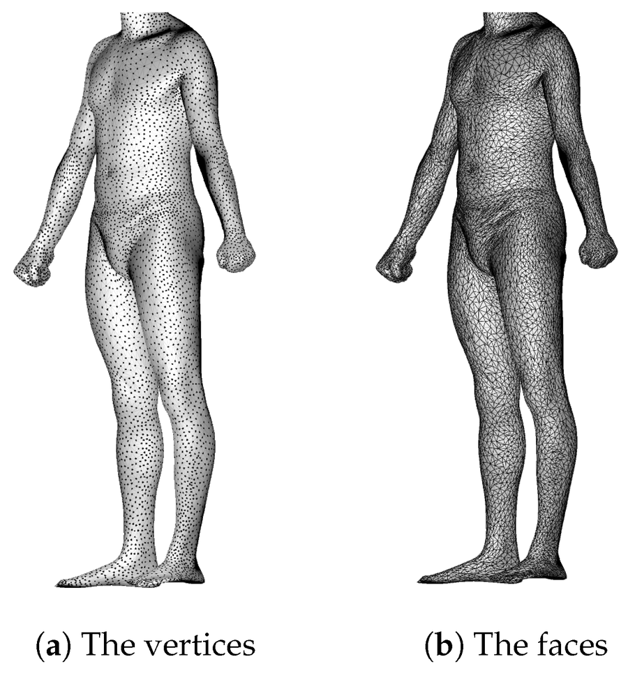</td>
    <td>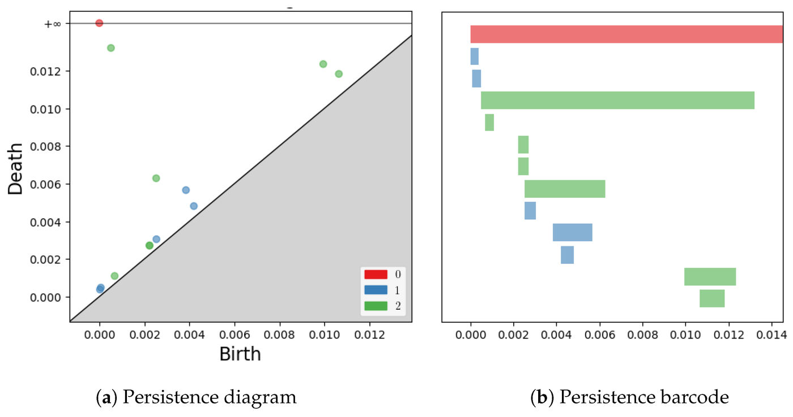</td>
  </tr>
  <tr>
    <td align="center"><em>A body scan (S0013): 12,500 vertices, 25,000 faces.</em></td>
    <td align="center"><em>Its persistence diagram and barcode (H0 red, H1 blue, H2 green).</em></td>
  </tr>
</table>

Unless stated otherwise, the figures of this page are taken from the paper,
which is published under the [CC BY 4.0](https://creativecommons.org/licenses/by/4.0/)
license.

---

## Contents

- [Method in a nutshell](#method-in-a-nutshell)
- [Data](#data)
- [Installation](#installation)
- [Reproducing the results](#reproducing-the-results)
- [Where each result of the paper is](#where-each-result-of-the-paper-is)
- [Repository structure](#repository-structure)
- [Using the code from Python](#using-the-code-from-python)
- [Correspondence with the original code](#correspondence-with-the-original-code)
- [Reproducibility](#reproducibility)
- [Tests](#tests)
- [Citation](#citation)

## Method in a nutshell

### Persistent homology of body scans

Each body scan is a point cloud of 12,500 vertices. Every cloud is scaled to a
height of 1.70 m, so that morphotypes do not depend on height. Persistent
homology of its alpha complex then gives three persistence diagrams:

* H0: connected components;
* H1: loops (between the legs, around the feet...);
* H2: cavities (torso, legs, head...).

The homology classes can be interpreted in terms of anatomy by drawing, for
each class, the simplices that create and kill it (`representatives.py`):

<p align="center">
  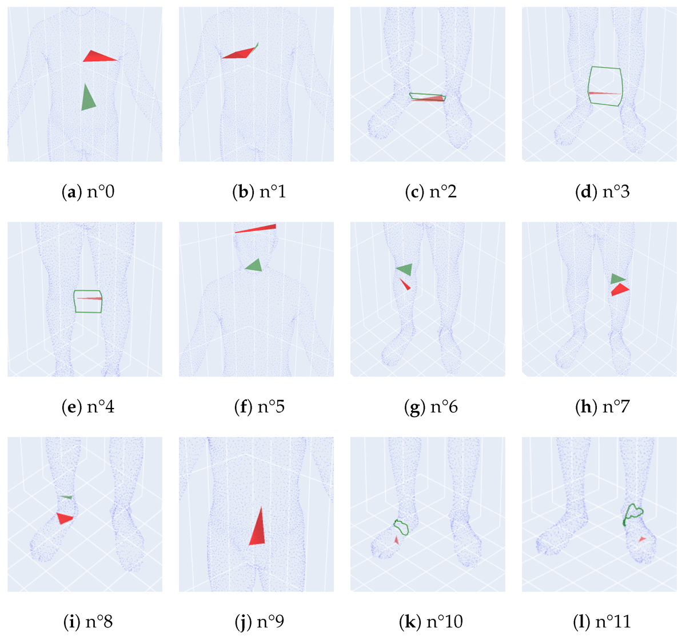
  <br>
  <em>The 12 non-H0 classes of S0013: n°0 and 1 are the torso, n°2 to 4 loops
  between the legs, n°5 the head, n°6 to 8 the calves and a foot, n°9 the whole
  body, n°10 and 11 loops around the feet. Creating simplices are green,
  killing simplices red.</em>
</p>

### Comparing individuals

The diagrams are compared in two ways:

* with the **(2, 2)-Wasserstein distance** between diagrams;
* with the **Euclidean distance** between **persistence silhouettes**: 25 + 250 +
  250 samples of the H0, H1 and H2 silhouettes, i.e. a vector of dimension 525
  per individual.

<table>
  <tr>
    <td width="52%">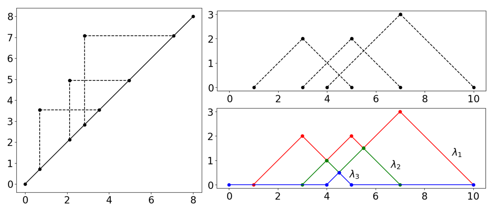</td>
    <td>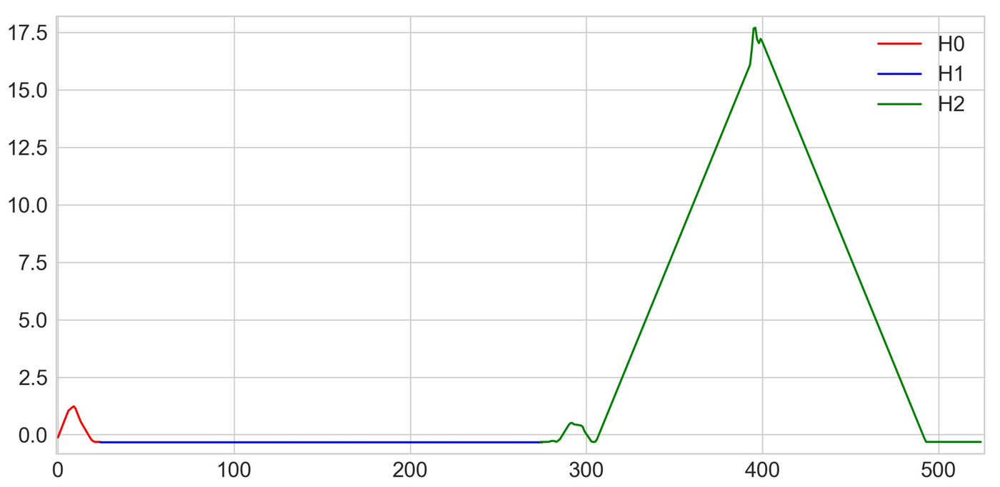</td>
  </tr>
  <tr>
    <td align="center"><em>From a persistence diagram to its landscapes; a silhouette is a weighted mean of these tent functions.</em></td>
    <td align="center"><em>The 525-dimensional silhouette vector of an individual.</em></td>
  </tr>
</table>

These two representations feed the three analyses of the paper:

```
 scan (.obj) ──► height normalisation ──► alpha complex ──► diagrams H0, H1, H2
   (or trunk isolation, section 4.2)                              │
                                             ┌────────────────────┴────────────────────┐
                                  Wasserstein distances                     silhouette vectors
                                             │                                         │
            ┌────────────────────────────────┼────────────────┐             ┌──────────┴──────────┐
  complete linkage                    complete / Ward /                Ward / K-Means /       Ward
  → scan anomalies                    K-Medoids → GDI                  K-Medoids → GDI        → morphotypes
  (section 3)                         (section 4)                      (section 4)            (section 5)
```

### 1. Anomaly detection (section 3)

In complete-linkage dendrograms of each sex, scan anomalies are individuals
that stay alone until late in the merging. The truncation that best isolates
the known anomalies is chosen, and gives 4 of the 5 male and 3 of the 4 female
anomalies:

<p align="center">
  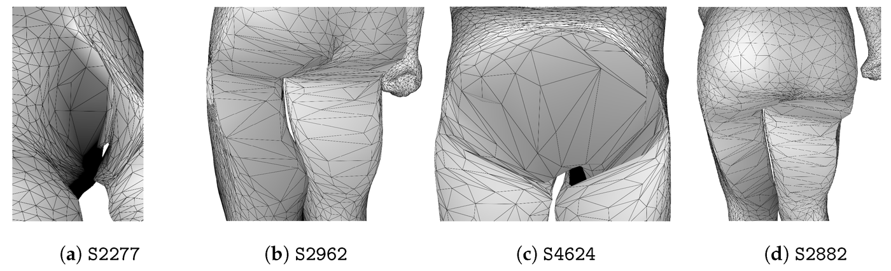
  <br>
  <em>Male scan anomalies detected: holes and misplaced points.</em>
</p>

Persistence explains why: in the defective scan S2962, the two legs create H2
classes of their own instead of being part of the principal H2 class of the
body.

<table>
  <tr>
    <td width="50%">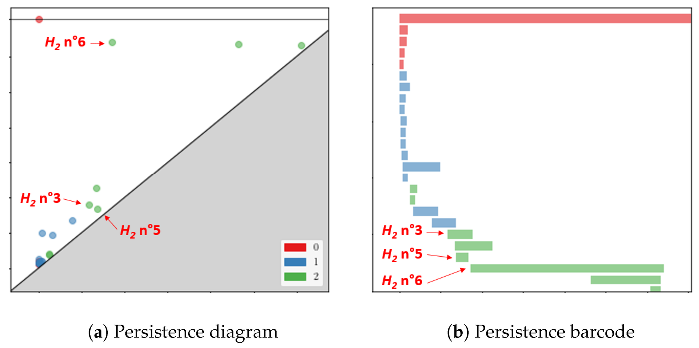</td>
    <td>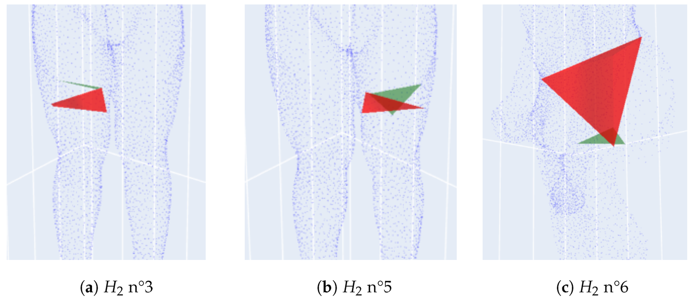</td>
  </tr>
  <tr>
    <td align="center"><em>Persistence diagram and barcode of S2962, with its three abnormal H2 classes.</em></td>
    <td align="center"><em>These classes (right leg, left leg, torso) at birth (green) and death (red).</em></td>
  </tr>
</table>

### 2. Gender discrimination index (section 4)

The GDI measures how well a clustering of the 3048 men and women separates the
sexes: 1 for a perfect separation, 0 for none. It is computed for several
algorithms and numbers of clusters, on the persistence diagrams and on the
silhouettes, for whole bodies and for trunks. Silhouettes separate the sexes
much better than diagrams, and restricting them to the trunk improves K-Medoids
further:

<p align="center">
  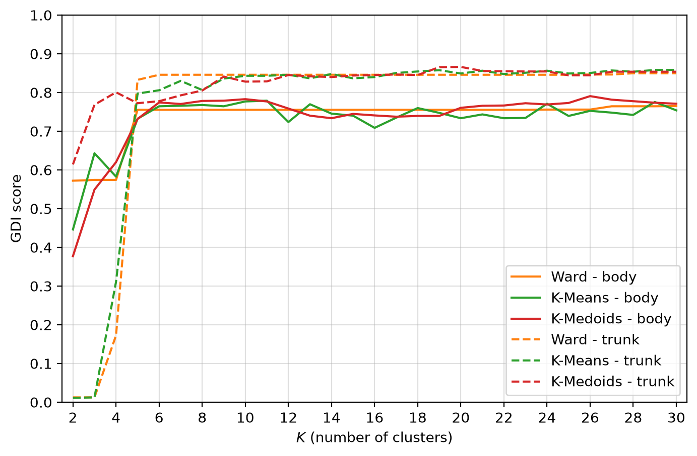
  <br>
  <em>GDI of the clusterings of silhouettes, whole bodies (solid) and trunks (dashed),
  as recomputed by this code (Figure 17).</em>
</p>

### 3. Morphotypes (section 5)

Ward clusterings of the silhouettes, truncated with the elbow, Davies-Bouldin,
Silhouette and Dunn indices, give 8 male and 7 female morphotypes. They differ
by weight class and by the ratios between bust, waist and hip circumferences.
Each morphotype is represented by its medoid.

<table>
  <tr>
    <td width="55%">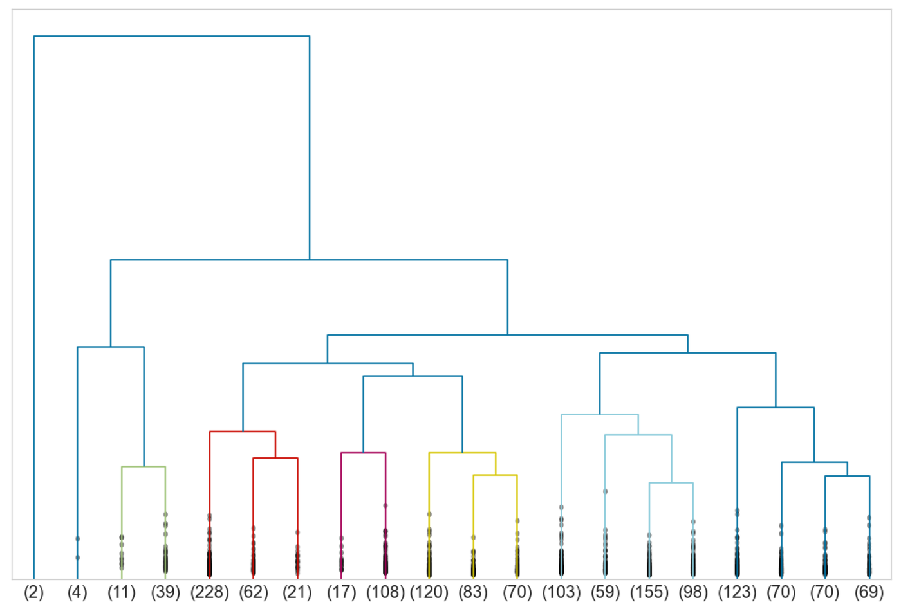</td>
    <td>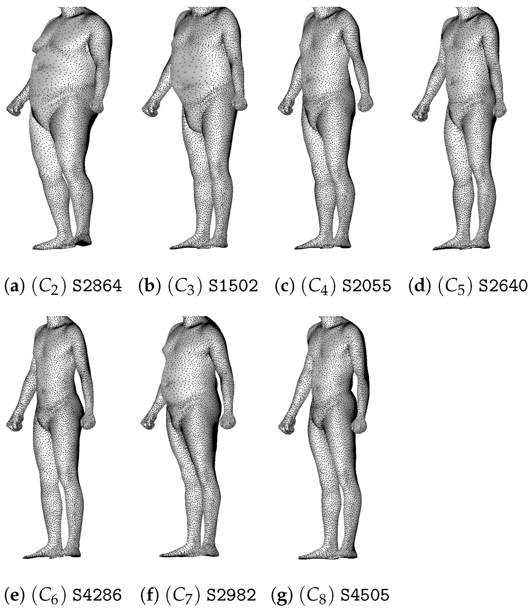</td>
  </tr>
  <tr>
    <td align="center"><em>Ward dendrogram of the male silhouettes.</em></td>
    <td align="center"><em>Medoids of the male morphotypes C2 to C8.</em></td>
  </tr>
</table>

## Data

### Raw scans (not included)

The scans are **not included** in this repository and must be downloaded
separately. They are needed to recompute the persistence diagrams and to draw
the figures showing bodies.

The code uses the **SPRING** meshes: 1517 men and 1531 women, 12,500 vertices
and 25,000 triangles each, registered with point-to-point correspondence.

1. Go to <https://graphics.soe.ucsc.edu/data/BodyModels/index.html>. Access
   requires filling in the registration form linked on that page, and
   commercial use of the data is not allowed.
2. Download `SPRING_MALE.zip` and `SPRING_FEMALE.zip` (about 900 MB each).
3. Extract the `.obj` files to `data/raw/`. The archives contain a
   `SPRING_MALE/` and a `mesh/` folder respectively:

   ```bash
   unzip -j SPRING_MALE.zip "*.obj" -d data/raw/male
   unzip -j SPRING_FEMALE.zip "*.obj" -d data/raw/female
   ```

   which gives

   ```
   data/raw/male/SPRING0001.obj ... SPRING4800.obj    (1517 files)
   data/raw/female/SPRING0014.obj ... SPRING4798.obj  (1531 files)
   ```

The SPRING meshes were built by Yang et al. (2014) from the scans of the
**CAESAR** database (Civilian American and European Surface Anthropometry
Resource): 3D scans of thousands of men and women aged 18 to 65 from the United
States, Canada, the Netherlands and Italy. For the original CAESAR data, see
<https://humanshape.org/Research.html#publications>.

If you use the data, please cite

> Y. Yang, Y. Yu, Y. Zhou, S. Du, J. Davis, R. Yang. Semantic Parametric
> Reshaping of Human Body Models. *2014 2nd International Conference on 3D
> Vision (3DV)*, Workshop on Dynamic Shape Measurement and Analysis, Tokyo,
> vol. 2, pp. 41-48, 2014.

`data/raw/` is ignored by git.

### Processed data (included)

The persistence diagrams of the 3048 scans, the expensive part of the pipeline
(about an hour of computation), are included in `data/cache/diagrams/`
(1.8 MB):

| File | Scans | Preprocessing | Used for |
|---|---|---|---|
| `body_m_{male,female}.npz` | 1517 men, 1531 women | height 1.70 m (rounded height), minimum persistence 3e-4 m^2 | sections 3 and 5 |
| `body_cm_{male,female}.npz` | 1517 men, 1531 women | height 170 cm, minimum persistence 3 cm^2 | section 4 |
| `trunk_{male,female}.npz` | 1517 men, 1531 women | isolated trunks, minimum persistence 5.5 cm^2 | section 4.2 |

Each `.npz` file stores the H0, H1 and H2 diagrams (birth, death) of every
scan. Its `.json` companion lists the scan names and the settings.
`DiagramSet.load` reads the file (see [Using the code from Python](#using-the-code-from-python)).
These diagrams are derived from the SPRING data and are subject to the same
terms: no commercial use.

The Wasserstein distance matrices (250 MB) are not included; they are
recomputed from the diagrams in about 10 minutes.

## Installation

Python >= 3.10 (tested with Python 3.12 on Windows 10).

```bash
git clone https://github.com/PhilippeMeyer68/TDA_Morphotypes.git
cd TDA_Morphotypes
python -m venv .venv
source .venv/bin/activate          # Windows: .venv\Scripts\activate
pip install -e ".[test]"
```

The dependencies are gudhi, numpy, scipy, scikit-learn, pandas, matplotlib and
meshio. `requirements.txt` pins the exact versions used to produce
[`results/`](results/):

```bash
pip install -r requirements.txt
pip install -e . --no-deps
```

## Reproducing the results

### From the included diagrams (no download)

Right after cloning, sections 3 to 5 can be reproduced from the diagrams of
`data/cache/diagrams/`:

```bash
tda-morphotypes all -j 8
```

This takes about 25 minutes (distances, then GDI). All the tables and data
curves are recomputed. What needs the meshes is skipped with a message: the
illustrations of section 2 (Figures 1, 2, 5, 6, 9, 10, 15) and the renderings
of bodies (Figures 8, 12, 19, 20, 22).

### From the raw scans

With the scans in `data/raw/`, the same command recomputes everything,
including the diagrams if `data/cache/diagrams/` is removed:

```bash
tda-morphotypes all -j 8
```

This runs the whole pipeline with 8 processes, writes tables and figures to
`results/` and ends with the comparison with the paper:

```
143/144 values identical to the paper, 1 known discrepancy, 0 mismatch; see results/README.md
```

The steps can also be run one at a time, in this order:

| Command | What it does | Time (8 processes) |
|---|---|---|
| `tda-morphotypes diagrams` | persistence diagrams of the 3048 scans, for the three preprocessings used in the paper | ~1 h |
| `tda-morphotypes distances` | Wasserstein distance matrices | ~10 min |
| `tda-morphotypes anomalies` | section 3: anomaly detection | < 1 min |
| `tda-morphotypes gdi` | section 4: gender discrimination index | ~12 min |
| `tda-morphotypes morphotypes` | section 5: male and female morphotypes | < 1 min |
| `tda-morphotypes figures` | illustrations of section 2 (diagrams, homology representatives, trunk) | ~1 min |
| `tda-morphotypes report` | compares the results with the paper, writes `results/README.md` | seconds |

Diagrams and distances, the expensive steps, are cached in `data/cache/`. Later
runs reuse them, so a section can be re-run in minutes. Cached diagrams are
recomputed automatically if the settings or the list of scans change.

Options:

* `--data-dir` (default `data/raw`);
* `--cache-dir` (default `data/cache`);
* `--results-dir` (default `results`);
* `-j/--jobs` (default: all CPUs).

`python -m tda_morphotypes ...` is equivalent to `tda-morphotypes ...`.

## Where each result of the paper is

After a run, [`results/README.md`](results/README.md) shows the recomputed
tables next to the figures, and `results/comparison_with_paper.csv` gives the
check of each value.

| Paper | Output |
|---|---|
| Figure 1: mesh of S0013 | `figures/fig01_mesh_S0013.png` |
| Figure 2: persistence diagram and barcode of S0013 | `figures/fig02_diagram_barcode_S0013.png` |
| Figures 3, 4: landscapes and silhouettes | schematic drawings, not generated |
| Figure 5: the 12 homology classes of S0013 | `figures/fig05_homologies_S0013.png` |
| Figure 6: effect of the normalisation | `figures/fig06_normalisation_example.png`, closest pairs in `figures/summary.json` |
| Section 3: truncation criterion and best ranges | `anomalies/{male,female}_percentages.csv`, `anomalies/summary.json`, `figures/anomalies_criterion_*.png` |
| Figures 7, 11: anomaly dendrograms | `figures/fig07_anomalies_dendrogram_male.png`, `figures/fig11_anomalies_dendrogram_female.png` |
| Figures 8, 12: detected anomalies | `figures/fig08_anomalies_male.png`, `figures/fig12_anomalies_female.png` |
| Figures 9, 10: anomaly S2962 | `figures/fig09_diagram_barcode_S2962.png`, `figures/fig10_homologies_S2962.png` |
| Figures 13, 14, 16, 17: GDI curves | `gdi/gdi_curves.csv`, `figures/fig13_*.png`, `fig14_*.png`, `fig16_*.png`, `fig17_*.png` |
| Tables 1, 2: mean GDI | `gdi/summary.json` |
| Figure 15: trunk isolation | `figures/fig15_trunk_S0013.png` |
| Figures 18, 21: Ward dendrograms | `figures/fig18_ward_dendrogram_male.png`, `figures/fig21_ward_dendrogram_female.png` |
| Choice of 8 and 7 clusters (elbow, Davies-Bouldin, Silhouette, Dunn) | `morphotypes/{male,female}_indices.csv`, `figures/morphotypes_indices_*.png` |
| Tables 3, 4: morphotypes | `morphotypes/{male,female}_table.csv` |
| Figures 19, 20, 22: cluster C1 of men and medoids | `figures/fig19_male_cluster_C1.png`, `fig20_medoids_male.png`, `fig22_medoids_female.png` |
| Morphotype of each individual | `morphotypes/{male,female}_clusters.csv` |

Paths are relative to `results/`. As in the paper, the heads are removed from
the renderings.

## Repository structure

```
TDA_Morphotypes/
├── README.md
├── pyproject.toml              package definition, dependencies, `tda-morphotypes` command
├── requirements.txt            exact versions used for results/
├── src/tda_morphotypes/
│   ├── config.py               all the settings of the paper: normalisations, thresholds,
│   │                           silhouette weights, known anomalies, numbers of clusters
│   ├── data.py                 access to the SPRING meshes (all_scans, scan_from_index)
│   ├── geometry.py             height normalisation (normalize_scan), trunk isolation (body_to_trunk)
│   ├── persistence.py          alpha complexes and decolored diagrams [H0, H1, H2]
│   │                           (point_set, decolored_diag), storage of the diagrams (DiagramSet)
│   ├── wasserstein.py          exact Wasserstein distances (decolored_dist, distance_matrix)
│   ├── silhouettes.py          persistence silhouettes and the 525-dimensional vectors
│   ├── clustering.py           dict_clusters, K-Means and K-Medoids with the 2022 behaviour
│   ├── indices.py              GDI, Davies-Bouldin, Silhouette and Dunn indices, cluster descriptors
│   ├── anomalies.py            anomalies as late-merging singletons (percent1, percent2, percent3)
│   ├── representatives.py      geometric representatives of homology classes (find_homologies)
│   ├── plotting.py             figures
│   ├── workflow.py             one function per section of the paper, cache of diagrams and distances
│   ├── report.py               comparison with the paper, results/README.md
│   ├── cli.py                  command line interface
│   └── reference/              values printed in the paper and GDI curves of the original 2022 run
├── tests/                      unit tests (pytest)
├── docs/
│   ├── reproducibility.md      how the original computations were recovered and reproduced
│   └── figures/                figures of the paper shown in this README
├── results/                    tables, curves and figures produced by the pipeline
└── data/
    ├── raw/                    (not versioned) SPRING meshes, see Data
    └── cache/
        ├── diagrams/           persistence diagrams of the 3048 scans (versioned)
        └── distances/          (not versioned) Wasserstein distance matrices
```

`workflow.py` is the entry point to read the code: each `run_*` function
follows one section of the paper and calls the modules above.

## Using the code from Python

The building blocks can be used directly. For example:

```python
from scipy.cluster.hierarchy import fcluster, linkage

from tda_morphotypes.clustering import KMedoids, make_dict_clusters
from tda_morphotypes.config import KNOWN_ANOMALIES, MORPHOTYPE_SILHOUETTE
from tda_morphotypes.data import scan_from_index
from tda_morphotypes.indices import Dunn
from tda_morphotypes.persistence import DiagramSet, point_set
from tda_morphotypes.silhouettes import silhouette_vectors
from tda_morphotypes.wasserstein import decolored_dist

# persistence diagrams of two scans scaled to 170 cm (needs the meshes in data/raw)
X = []
for i in (0, 1):
    PS = point_set(scan_from_index(i, "male"))
    PS.normalize(170)
    X.append(PS.DecoloredPersistence(min_persistence=3))  # [H0, H1, H2]
print(decolored_dist(X[0], X[1]))  # Wasserstein distance between the two scans

# silhouette vectors and Ward clustering of the women, from the included diagrams
# (the known scan anomalies are removed, as in the paper)
X_decolor = DiagramSet.load("data/cache/diagrams/body_m_female.npz").without(KNOWN_ANOMALIES["female"])
sh = silhouette_vectors(X_decolor, MORPHOTYPE_SILHOUETTE)
clusters = fcluster(linkage(sh, method="ward"), 7, criterion="maxclust")
print(Dunn(make_dict_clusters(clusters), sh))  # 0.234, as in the paper
print(KMedoids(n_clusters=7, method="pam", init="k-medoids++", random_state=42).fit(sh).labels_)
```

## Correspondence with the original code

The published results were computed in 2022 with Jupyter notebooks: those of
S. de Rose's internship (earlier history of this repository) and those of
P. Meyer. This code keeps their structure and function names. Global variables
became arguments, and the few French names were translated.

| Original | Here |
|---|---|
| `os.listdir(pathglob)`, `scan_from_index(i)` | `data.all_scans`, `data.scan_from_index` |
| `taille_scan`, `normalize_scan`, `point_set.normalize` | `geometry.scan_height`, `geometry.normalize_scan`, `point_set.normalize` |
| `body_to_trunk` (`trunk.py`) | `geometry.body_to_trunk` |
| `point_set` (`AlphaComplex`, `SimplexTree`, `Persistence`, `DecoloredPersistence`), `decolored_diag` | `persistence.point_set`, `persistence.decolored_diag` |
| `X_decolor` lists saved with pickle | `persistence.DiagramSet` (`.npz` files in `data/cache/diagrams`) |
| `decolored_dist`, `wasserstein_dist` | `wasserstein.decolored_dist` |
| `dict_dist` / `X_Dist_H*.bin`, then `zip(*sorted(dict_dist.items()))` | `wasserstein.distance_matrix` (condensed matrices in `data/cache/distances`) |
| gudhi `Silhouette(resolution, weight).fit_transform`, `sh = (sh - sh.mean()) / sh.std()` | `silhouettes.Silhouette`, `silhouettes.silhouette_vectors` |
| `linkage`, `fcluster(Z, nb_clus, criterion='maxclust')`, `dict_clusters` | the same scipy functions, `clustering.make_dict_clusters` |
| `KMeans(nb_clus, random_state=42)` (scikit-learn 1.1) | `clustering.KMeans` |
| `KMedoids(..., method='pam', init='k-medoids++')` (scikit-learn-extra) | `clustering.KMedoids` |
| GDI loop (`male_percentage`, `test`) | `indices.GDI` |
| `indice_DB`, `silhouette()`, `Dunn` | `indices.DB_index`, `indices.silhouette_index`, `indices.Dunn` |
| `medoid`, `cluster_taille_moyenne`, `cluster_diameter`, `cluster_distance_centre`, `cluster_distance_mean_medoid` | `indices.medoid`, `indices.cluster_mean_distance`, `indices.cluster_diameter`, `indices.cluster_distance_centre`, `indices.cluster_distance_mean_medoid` |
| `percent1`, `percent2`, `percent3`, `solos` (anomaly notebook) | `anomalies.anomaly_percentages`, `anomalies.best_range`, `anomalies.solos` |
| `find_homologies`, `plot_H0`, `plot_H1`, `plot_H2` (`Homology_Plot`) | `representatives.find_homologies`, `plotting.plot_H0/H1/H2` |

## Reproducibility

The two sets of notebooks behind the paper did not preprocess the scans in
exactly the same way. Some results also depend on the behaviour of the
library versions of 2022 (gudhi 3.5/3.6, POT, scikit-learn 1.1,
scikit-learn-extra 0.2). Everything needed to obtain the published numbers is
encoded explicitly in [`config.py`](src/tda_morphotypes/config.py):

* **Normalisation.** Sections 3 and 5 scale bodies to 1.7 m after rounding the
  measured height to the centimetre (minimum persistence 3e-4 m^2). Section 4
  scales them to 170 cm without rounding (3 cm^2 for the diagrams, 5.25 cm^2
  for the silhouettes, 5.5 cm^2 for the trunks).
* **Anomaly distances.** In the original anomaly detection, the H0 term of the
  distance was zero, so only H1 and H2 are used.
* **Body silhouettes of section 4.** The H1 block of these silhouettes was zero
  in the original run.
* **Library behaviour of 2022.** Silhouettes use the sampling range of gudhi
  <= 3.7. K-Means draws its initialisations like scikit-learn 1.1, and
  K-Medoids is scikit-learn-extra's PAM, reimplemented.

The recomputed diagrams and distances were compared with those saved in 2022.
The diagrams have the same number of points for every scan, and every value
agrees to better than 1e-10 in relative terms. The GDI curves are identical.

The only difference with the paper is in Table 4. Cluster C3 of the women is
printed as 27 % but represents 403 / 1527 = 26.4 % of them: the original
notebook divided by 1513.

[`docs/reproducibility.md`](docs/reproducibility.md) gives the details.

## Tests

```bash
pytest
```

The tests check each reimplemented algorithm against its reference:

* Wasserstein distances against gudhi/POT;
* silhouettes against gudhi, in its current version and in the 2022 one;
* K-Medoids against a line-by-line transcription of scikit-learn-extra's PAM;
* indices against scikit-learn.

## Citation

If you use this code, please cite the paper:

```bibtex
@article{deRose2023,
  author  = {de Rose, Steve and Meyer, Philippe and Bertrand, Fr{\'e}d{\'e}ric},
  title   = {Human Body Shapes Anomaly Detection and Classification Using Persistent Homology},
  journal = {Algorithms},
  volume  = {16},
  number  = {3},
  pages   = {161},
  year    = {2023},
  doi     = {10.3390/a16030161}
}
```

and the SPRING dataset:

```bibtex
@inproceedings{Yang2014,
  author    = {Yang, Yipin and Yu, Yao and Zhou, Yu and Du, Sidan and Davis, James and Yang, Ruigang},
  title     = {Semantic Parametric Reshaping of Human Body Models},
  booktitle = {2014 2nd International Conference on 3D Vision (3DV), Workshop on Dynamic Shape Measurement and Analysis},
  volume    = {2},
  pages     = {41--48},
  year      = {2014}
}
```
