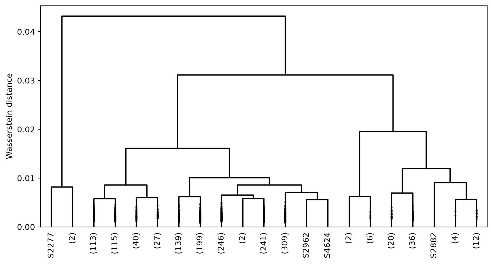
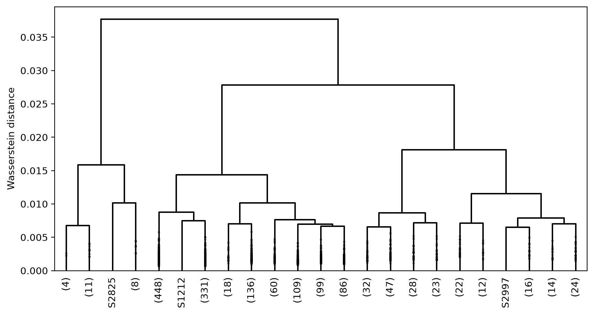
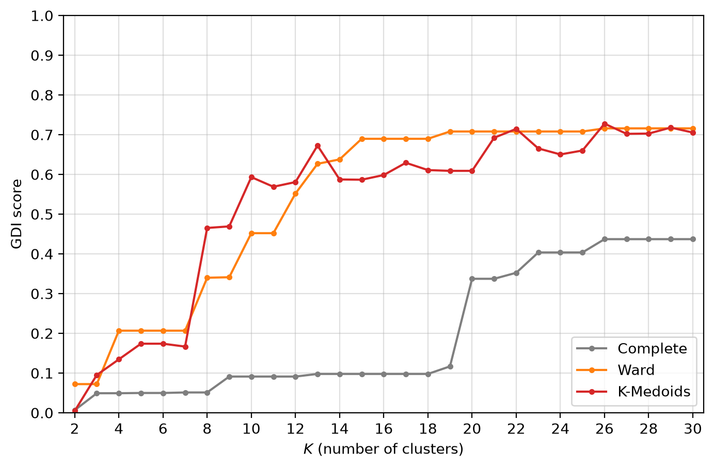
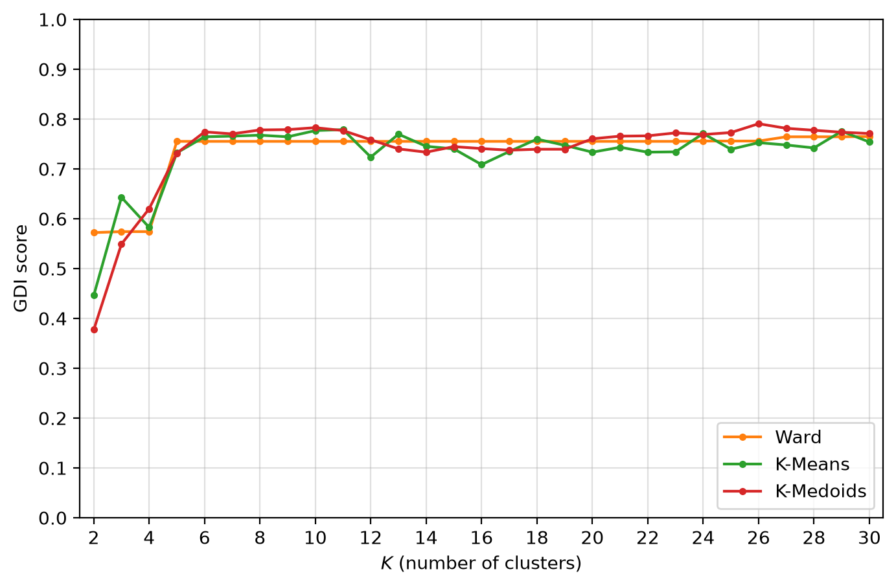
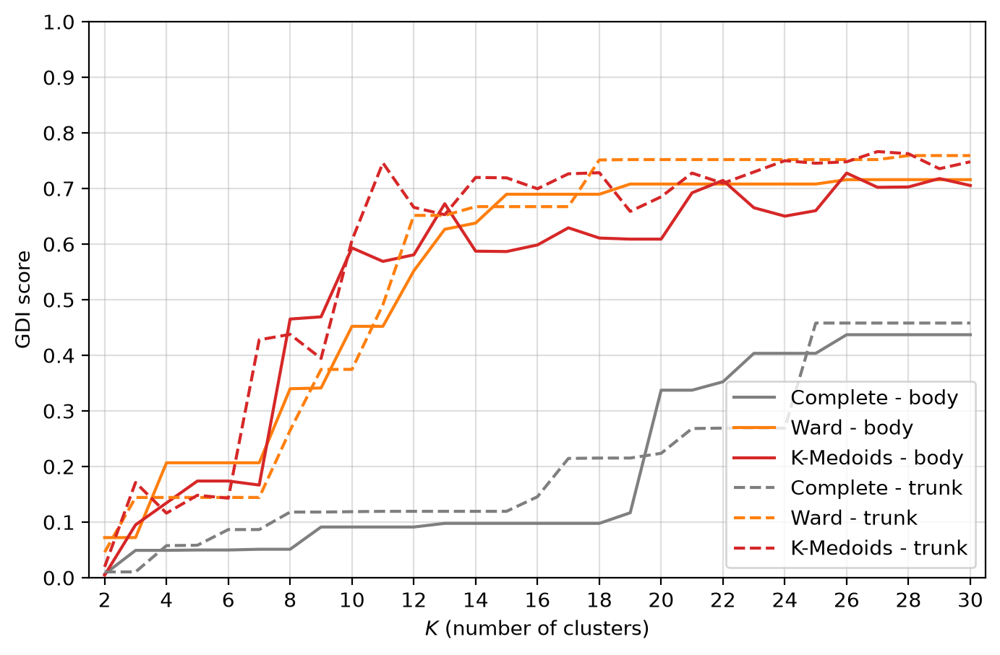
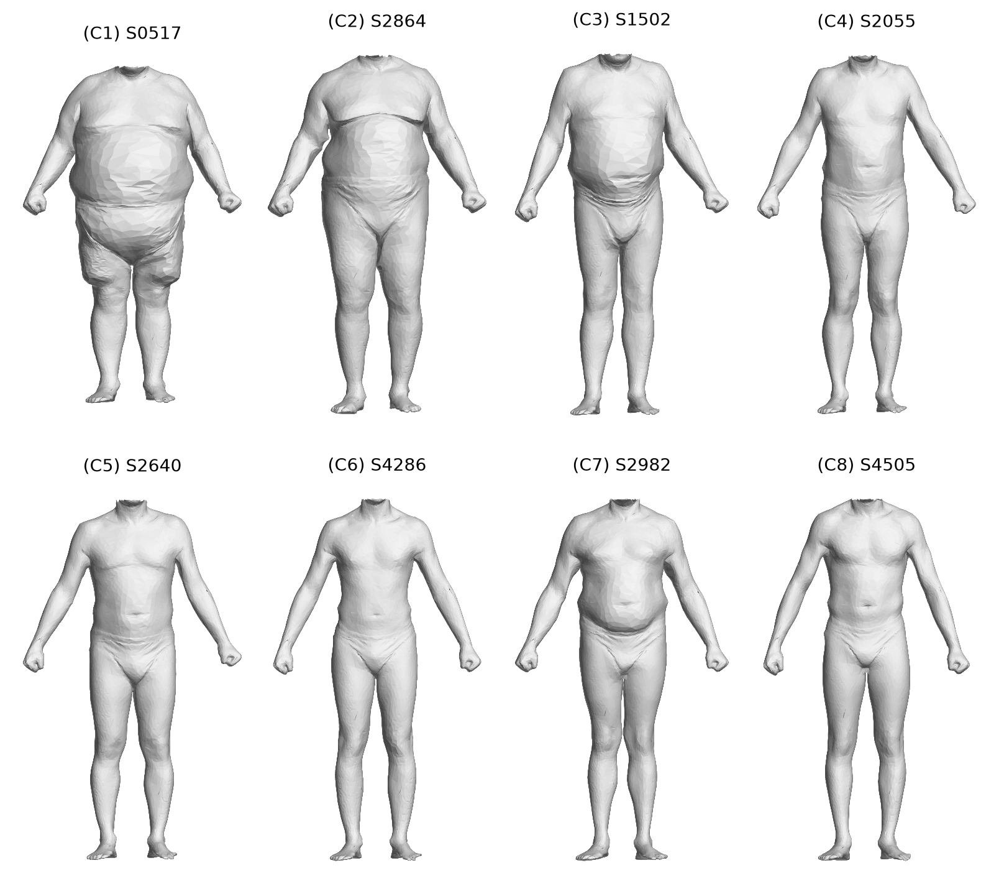
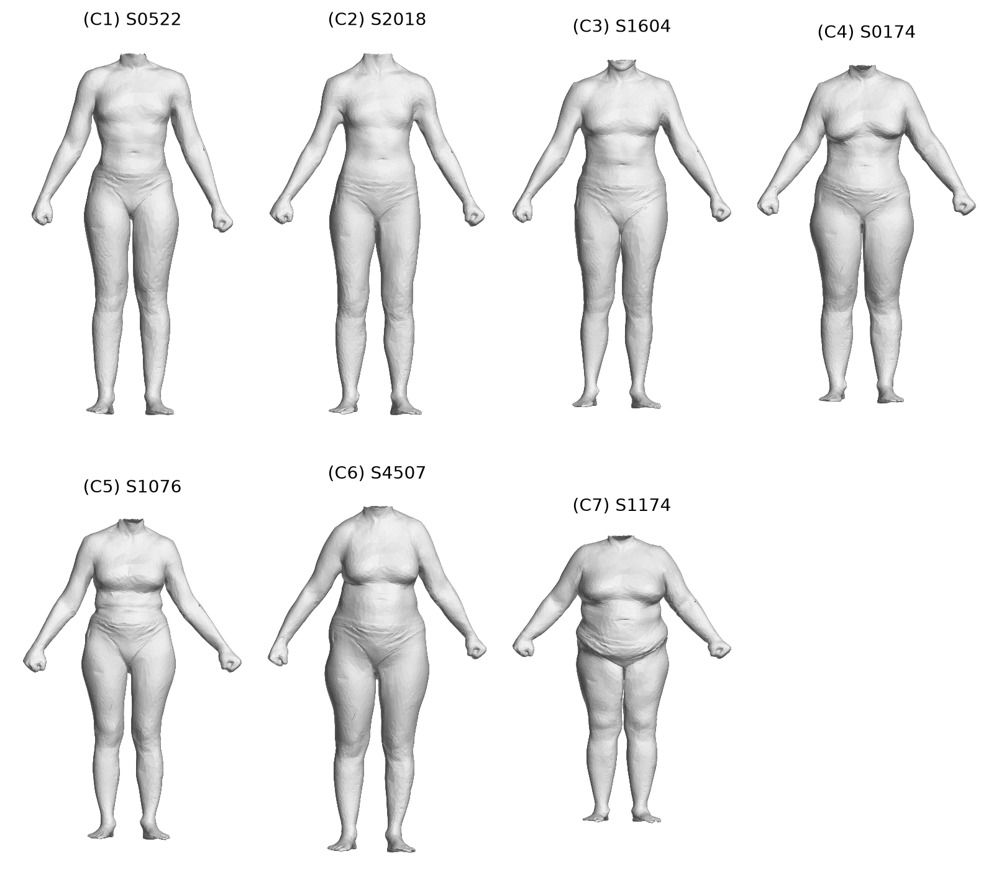

# Results

Generated by `tda-morphotypes report`. Every value is compared with the published paper
(rounded as printed there) and the GDI curves with the outputs of the original 2022 run
(`src/tda_morphotypes/reference/`).

**143 / 144 values identical to the paper**, 1 known discrepancy, 0 mismatch.

## Section 3 - Anomaly detection

| sex | best range | isolated that are anomalies (%) | anomalies isolated (%) | detected |
|---|---|---|---|---|
| male | [21, 46] | 100.0 | 80.0 | SPRING2277, SPRING2882, SPRING2962, SPRING4624 |
| female | [23, 37] | 100.0 | 75.0 | SPRING1212, SPRING2825, SPRING2997 |

## Section 4 - Gender discrimination index

**Table 1 - mean GDI, persistence diagrams**

|  | complete | ward | kmedoids |
|---|---|---|---|
| body | 0.2 | 0.54 | 0.526 |
| trunk | 0.21 | 0.553 | 0.582 |

**Table 2 - mean GDI, persistence silhouettes**

|  | ward | kmeans | kmedoids |
|---|---|---|---|
| body | 0.738 | 0.73 | 0.737 |
| trunk | 0.765 | 0.767 | 0.827 |

## Section 5 - Morphotypes

**Table 3 - male morphotypes** (1512 scans)

| cluster | size | proportion_pct | mean_distance | diameter | distance_to_mean | distance_mean_medoid | medoid |
|---|---|---|---|---|---|---|---|
| C1 | 2 | 0.1 | 79.6 | 79.6 | 39.8 | 39.8 | SPRING0517 |
| C2 | 4 | 0.3 | 39.4 | 53.9 | 24.4 | 20.1 | SPRING2864 |
| C3 | 50 | 3.3 | 28.6 | 62.0 | 19.6 | 9.0 | SPRING1502 |
| C4 | 311 | 20.6 | 17.4 | 49.6 | 12.1 | 3.4 | SPRING2055 |
| C5 | 125 | 8.3 | 20.3 | 59.2 | 14.2 | 5.9 | SPRING2640 |
| C6 | 273 | 18.1 | 16.3 | 54.6 | 11.5 | 6.9 | SPRING4286 |
| C7 | 415 | 27.4 | 18.9 | 67.1 | 13.1 | 5.1 | SPRING2982 |
| C8 | 332 | 22.0 | 19.4 | 69.4 | 13.6 | 6.1 | SPRING4505 |

Local optima of the indices for 3 to 20 clusters: Davies-Bouldin 8, 12, 15, 18; Silhouette 5, 15; Dunn 8, 12, 17, 19.

**Table 4 - female morphotypes** (1527 scans)

| cluster | size | proportion_pct | mean_distance | diameter | distance_to_mean | distance_mean_medoid | medoid |
|---|---|---|---|---|---|---|---|
| C1 | 306 | 20.0 | 14.2 | 36.6 | 10.1 | 3.4 | SPRING0522 |
| C2 | 263 | 17.2 | 12.7 | 32.0 | 9.0 | 3.4 | SPRING2018 |
| C3 | 403 | 26.4 | 14.1 | 32.1 | 10.1 | 4.5 | SPRING1604 |
| C4 | 107 | 7.0 | 14.3 | 31.9 | 10.1 | 3.3 | SPRING0174 |
| C5 | 122 | 8.0 | 14.0 | 38.2 | 9.9 | 3.6 | SPRING1076 |
| C6 | 112 | 7.3 | 19.0 | 59.3 | 13.3 | 5.9 | SPRING4507 |
| C7 | 214 | 14.0 | 21.3 | 62.4 | 14.8 | 5.2 | SPRING1174 |

Local optima of the indices for 3 to 20 clusters: Davies-Bouldin 8, 12, 17; Silhouette 7, 11, 14, 16; Dunn 6, 7, 10, 11, 14, 17.

## Differences with the paper

| item | paper | obtained | status | note |
|---|---|---|---|---|
| female C3 proportion_pct | 27 | 26.39 | known discrepancy | The paper reports 27% for C3 (403 women). The original notebook divided by 1513 instead of 1527 (the 1531 female scans minus 4 anomalies); 403/1527 = 26.4%. |
